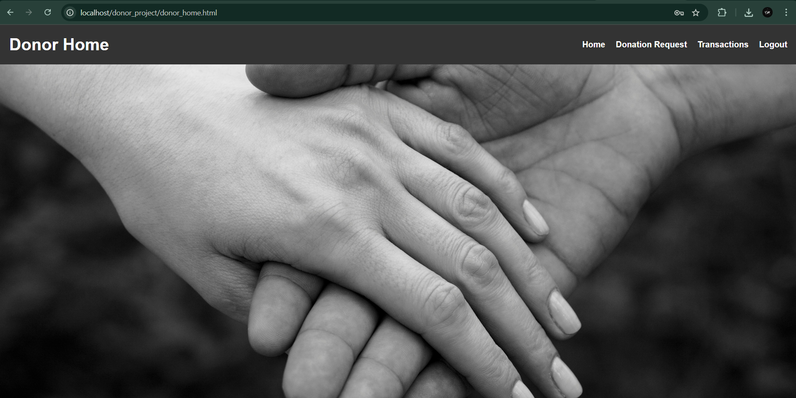

# Donation Mini Project

The Charity Donor Management System is a web platform that connects donors with charities, enabling campaign creation, donation tracking, and digital receipts. Built with PHP and MySQL, it features an admin dashboard for monitoring and approvals, ensuring transparency, security, and ease in managing donations and encouraging social responsibility.

### Screenshots

Main Page

Donor Page
